# SO-101 Isaac Lab

**End-to-end SO-101 imitation-learning pipeline from physical teleoperation to synthetic demonstration generation and ACT policy evaluation.**

Built with **Isaac Lab, Isaac Mimic, LeRobot, and Pinocchio**.

---

## Overview

This project connects a **physical SO-101 leader arm** to a simulated SO-101 follower in Isaac Lab and builds an end-to-end imitation-learning workflow:

**physical teleoperation → human demonstrations → Isaac Mimic augmentation → LeRobot dataset → ACT policy → simulation evaluation.**

The pipeline was designed to investigate whether synthetic demonstrations can expand manipulation data while preserving a joint-space action representation compatible with downstream ACT training.

### Demo

| Real Teleoperation | Sim Teloperation |
| :---: | :---: |
|  |  |

---

### Synthetic Demonstration Generation

Human demonstrations are converted into Mimic-compatible end-effector trajectories and augmented 
using **Isaac Mimic**.

<p align="center">
  
</p>

<p align="center">
  <b>Isaac Mimic — Synthetic Demonstration Generation</b>
</p>

During the generation run:

- **22** generation attempts
- **20** successful demonstrations
- **90.9% generation success rate**

> Mimic generation success indicates whether the synthesized trajectory successfully completed the manipulation task; it is separate from trained-policy evaluation.

---


### ACT Simulation Evaluation

The trained ACT policy was evaluated over **50 randomized simulation rollouts**.

| SUCCESS | GRASP FAIL |
| :---: | :---: |
|  |  |

**Overall success rate: 68.0% (34 / 50)**

```text
SUCCESS        ██████████████████████████████████  34 (68%)
APPROACH_FAIL  █████                               5 (10%)
GRASP_FAIL     ██████████                         10 (20%)
PLACE_FAIL     █                                   1 ( 2%)
```

---

## Architecture

```mermaid
flowchart LR

    subgraph Teleoperation
        A[Physical SO-101 Leader]
        B[Feetech Motor Bus]
        C[SO101Leader<br/>DeviceBase]
        D[Isaac Lab Environment]

        A --> B --> C --> D
    end

    subgraph Data_Generation["Demonstration & Data Generation"]
        E[Human Demonstration<br/>Joint Space]
        F[Isaac HDF5]
        G[Isaac Mimic<br/>EE Delta Space]
        H[Pinocchio IK]
        I[Synthetic Joint Targets]
        J[LeRobot Dataset]

        E --> F --> G --> H --> I --> J
    end

    subgraph Learning_Evaluation["Learning & Evaluation"]
        K[ACT Training]
        L[ACT Policy]
        M[Simulation Rollout]
        N[Failure Analysis]

        K --> L --> M --> N
    end

    D --> E
    J --> K

```



---

## Key Implementations

### 1. SO-101 Teleoperation

A custom Isaac Lab `DeviceBase` interface connects the physical SO-101 leader arm to the simulated follower.

```text
SO-101 Leader
    ↓
Feetech Motor Bus
    ↓
Motor Calibration
    ↓
Joint Positions
    ↓
SO101Leader.advance()
    ↓
Joint-space Action Tensor
    ↓
Isaac Lab
```

The Isaac Lab Manager-Based environment provides:

* SO-101 joint-position control
* joint position / velocity observations
* end-effector pose
* side-camera RGB
* wrist-camera RGB

Episode-level randomization varies object configurations, lighting exposure, and robot initial joint positions.

Random sampling and simulator reset are separated through `EpisodeRandomState`, allowing failed demonstrations to be retried under the same initial configuration.

---

### 2. Isaac Mimic & Cartesian Control

Human teleoperation is performed in **joint space**, while Isaac Mimic operates on end-effector trajectories.

Mimic-compatible demonstrations therefore store:

```text
[Δx, Δy, Δz, ΔRx, ΔRy, ΔRz, gripper]
```

along with the original SO-101 joint targets.

A custom Isaac Lab `ActionTerm` accumulates relative end-effector commands against the previous commanded pose and converts the resulting Cartesian target into SO-101 arm joint targets using Pinocchio-based inverse kinematics.

```text
Mimic EE Delta
      ↓
Commanded EE Pose
      ↓
Pinocchio IK
      ↓
5-DoF Arm Joint Targets
      +
Gripper Target
```

The Pinocchio kinematics module provides URDF-based forward kinematics, Jacobian computation, damped-least-squares inverse kinematics, and joint-limit handling.

Because the SO-101 arm has 5 actuated arm joints, the current controller prioritizes Cartesian position tracking rather than enforcing an arbitrary full 6-DoF pose.

Task-specific Mimic signals detect grasp completion from gripper state and EE-object proximity, while placement success is evaluated in the target bin's local coordinate frame.

---

### 3. Synthetic Dataset Pipeline

Isaac Mimic generates Cartesian trajectories, but the downstream ACT policy is trained using SO-101 joint-space actions.

Custom recorder terms therefore preserve the **post-IK arm joint targets and gripper command** for every generated trajectory step.

Camera observations are moved to CPU during recording to reduce GPU memory usage during long generation runs.

```text
Human Demonstration
        ↓
Isaac HDF5
        ↓
Mimic Annotation
        ↓
Isaac Mimic Generation
        ↓
Post-IK Joint Targets
        ↓
HDF5 → LeRobot Conversion
        ↓
LeRobotDataset
├── observation.state
├── observation.images.side_cam
├── observation.images.wrist_cam
├── action
└── task
```

The converter supports both teleoperation and Mimic-generated HDF5 observation layouts.

---

### 4. ACT Evaluation & Failure Analysis

Trained ACT checkpoints are evaluated directly in the Isaac Lab environment.

```text
Isaac Lab Observation
        ↓
joint state + dual RGB
        ↓
LeRobot Preprocessor
        ↓
ACTPolicy
        ↓
LeRobot Postprocessor
        ↓
SO-101 Joint Action
        ↓
Isaac Lab
```

Evaluation goes beyond binary task success by automatically classifying each rollout into:

| Result          | Description                                             |
| --------------- | ------------------------------------------------------- |
| `SUCCESS`       | Object successfully placed in the target bin            |
| `APPROACH_FAIL` | End-effector failed to sufficiently approach the object |
| `GRASP_FAIL`    | Object was approached but not successfully lifted       |
| `PLACE_FAIL`    | Object was lifted but final placement failed            |

Additional rollout metrics include minimum EE-object distance, maximum object lift, and episode length.

---

## Experiments & Results

The pipeline is designed to compare policy behavior under different demonstration distributions.

Example evaluation settings include:

* human demonstrations vs. Mimic-augmented demonstrations
* in-distribution initial configurations
* unseen or perturbed object configurations
* approach / grasp / placement failure-mode analysis

> Quantitative results and rollout visualizations will be added as experiments are finalized.

---

## Project Structure

```text
so101-isaaclab/
├── assets/SO101/                  # SO-101 URDF and meshes
│
├── scripts/
│   ├── envs/teleoperation/        # Teleoperation and demonstration recording
│   ├── mimic/                     # Mimic annotation and generation
│   ├── inference/                 # ACT simulation evaluation
│   └── tools/                     # Dataset conversion / inspection utilities
│
└── source/soarm101_lab/
    └── soarm101_lab/
        ├── devices/               # Physical SO-101 interface
        ├── tasks/                 # Isaac Lab environments and MDP terms
        └── utils/                 # Randomization and Pinocchio kinematics
```

---

# Installation

## Tested Environment

| Component | Version             |
| --------- | ------------------- |
| Python    | 3.11                |
| Isaac Sim | 5.1.0               |
| Isaac Lab | 2.3.0               |
| LeRobot   | 0.4.1 |
| FFmpeg    | 7.1.1               |

> This project uses a specific Isaac Sim / Isaac Lab environment because robotics simulation packages are sensitive to dependency and API version changes.

---

## 1. Create Conda Environment

```bash
conda create -y -n lerobot-isaac python=3.11
conda activate lerobot-isaac

conda install -y -c conda-forge ffmpeg=7.1.1

python -m pip install --upgrade pip
```

---

## 2. Install Isaac Sim 5.1.0

```bash
pip install "isaacsim[all,extscache]==5.1.0" \
    --extra-index-url https://pypi.nvidia.com
```

---

## 3. Install Isaac Lab 2.3.0

```bash
git clone https://github.com/isaac-sim/IsaacLab.git
cd IsaacLab

git checkout v2.3.0

./isaaclab.sh -i

cd ..
```

---

## 4. Install LeRobot 0.4.1

```bash
git clone https://github.com/huggingface/lerobot.git
cd lerobot

git checkout v0.4.1

pip install -e .

cd ..
```

For fully reproducible installation, the exact LeRobot commit used for the experiment can be pinned with:

```bash
cd lerobot
git rev-parse HEAD
```

and restored later using:

```bash
git checkout <LEROBOT_COMMIT>
```

---

## 5. Install Compatibility Dependencies

The following versions were used to keep the LeRobot / Hugging Face dependency stack compatible with this environment:

```bash
pip install \
    "transformers==4.57.1" \
    "huggingface-hub==0.35.3" \
    "click==8.1.7"
```

---

## 6. Install This Project

```bash
git clone https://github.com/HYEONHEE5739/so101-isaaclab.git
cd so101-isaaclab

pip install -e source/soarm101_lab
```

---

# Run

The full data-generation and evaluation workflow is:

```text
Teleoperation
    ↓
Record Mimic Source Demonstrations
    ↓
Annotate Demonstrations
    ↓
Generate Synthetic Demonstrations
    ↓
Convert HDF5 → LeRobot
    ↓
Train ACT
    ↓
Evaluate ACT in Isaac Lab
```

---

## 1. Live Teleoperation

Control the simulated SO-101 follower using a physical SO-101 leader arm.

```bash
python scripts/envs/teleoperation/teleop_so101.py \
    --port /dev/ttyACM0
```

---

## 2. Record Directly to LeRobotDataset

```bash
python scripts/envs/teleoperation/record_lerobot_dataset.py \
    --repo_id <user>/<dataset-name> \
    --single_task "pick red cube and place in bin a" \
    --repo_root ./datasets \
    --num_episodes 50 \
    --episode_time_s 20 \
    --reset_time_s 5 \
    --port /dev/ttyACM0
```

Recording controls:

| Key     | Action                                |
| ------- | ------------------------------------- |
| `RIGHT` | Save current episode                  |
| `LEFT`  | Discard and retry the current episode |
| `Q`     | Quit                                  |

---

## 3. Record Isaac Mimic Source Demonstrations

Record teleoperated demonstrations in Isaac Lab HDF5 format.

```bash
python scripts/envs/teleoperation/record_mimic_dataset.py \
    --dataset_file ./datasets/demo_20ep.hdf5 \
    --mimic_task SO101-PickPlace-Mimic-v1 \
    --grasp_object cube_red \
    --place_bin bin_a \
    --num_episodes 20 \
    --episode_time_s 20 \
    --device cuda:0 \
    --enable_cameras
```

---

## 4. Annotate Demonstrations

Annotate subtask boundaries required by Isaac Mimic.

```bash
python scripts/mimic/annotate_demos.py \
    --task SO101-PickPlace-Mimic-v1 \
    --input_file ./datasets/demo_20ep.hdf5 \
    --output_file ./datasets/annotated_demo_20ep.hdf5 \
    --device cuda:0 \
    --enable_cameras \
    --auto
```

Specific demonstrations can also be selected:

```bash
python scripts/mimic/annotate_demos.py \
    --task SO101-PickPlace-Mimic-v1 \
    --input_file ./datasets/demo_20ep.hdf5 \
    --output_file ./datasets/annotated_demo_selected.hdf5 \
    --device cuda:0 \
    --enable_cameras \
    --auto \
    --include 0 1 3-4 6-19
```

---

## 5. Generate Synthetic Demonstrations

Generate additional trajectories using Isaac Mimic.

```bash
python scripts/mimic/generate_dataset.py \
    --task SO101-PickPlace-Mimic-v1 \
    --input_file ./datasets/annotated_demo_20ep.hdf5 \
    --output_file ./datasets/generated_demo_20ep_50ep.hdf5 \
    --generation_num_trials 50 \
    --num_envs 1 \
    --device cuda:0 \
    --enable_cameras
```

---

## 6. Convert Isaac HDF5 to LeRobotDataset

Convert the generated trajectories into the multimodal dataset format used for ACT training.

```bash
python scripts/tools/convert_isaac2lerobot.py \
    --input_file ./datasets/generated_demo_20ep_50ep.hdf5 \
    --repo_id <user>/<dataset-name> \
    --root ./datasets/<dataset-name> \
    --task "pick red cube and place in bin a" \
    --action_source joint_targets
```

---

## 7. Train ACT

ACT training is performed using the converted LeRobot dataset.

The dataset contains:

```text
observation.state
observation.images.side_cam
observation.images.wrist_cam
action
task
```

Use the LeRobot training pipeline with the generated repository ID and the desired ACT configuration.

---

## 8. Evaluate ACT in Isaac Lab

```bash
python scripts/inference/inference_act_sim.py \
    --checkpoint <path-to-act-checkpoint>
```

The evaluation script runs randomized simulation episodes and exports episode-level success and failure-mode statistics.

---

## Tech Stack

| Technology          | Usage                                                        |
| ------------------- | ------------------------------------------------------------ |
| **Isaac Sim 5.1.0** | Physics simulation and rendering                             |
| **Isaac Lab 2.3.0** | Manager-Based environment and simulation interfaces          |
| **Isaac Mimic**     | Demonstration annotation and synthetic trajectory generation |
| **LeRobot 0.4.1**   | SO-101 hardware interface, dataset format, ACT policy        |
| **Pinocchio**       | Forward/inverse kinematics                                   |
| **PyTorch**         | Tensor processing and policy inference                       |
| **Feetech STS3215** | Physical SO-101 servo communication                          |
| **HDF5**            | Intermediate demonstration storage                           |
| **URDF / USD**      | Robot and simulation asset representation                    |
